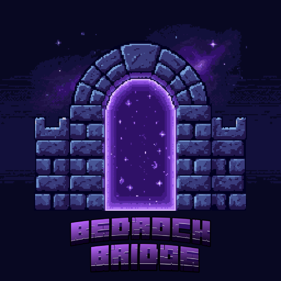

<p align="center">
  
</p>


A Fabric mod for Minecraft Java that lets **Minecraft Bedrock** players (phone, console, tablet, Windows 10) join your single-player world **with a single click**. No port-forwarding, no setup, no Microsoft account on the guest side.

Tick "Share with Bedrock" on the "Open to LAN" screen and BedrockBridge handles the rest:
1. Starts **Geyser** to translate the Java ↔ Bedrock protocol.
2. Starts **Floodgate** so Bedrock players can join without a Java account.
3. Starts a **Playit.gg** UDP tunnel that exposes port 19132 to the internet, so your guest can connect from any network without you opening router ports.

The public endpoint shows up in chat (e.g. `means-confidentiality.gl.at.ply.gg:6740`); the guest pastes it into MC Bedrock → Servers → Add Server and they're in.

---

## Requirements

- Minecraft Java **1.26.1.2** (alias 26.1.2).
- Fabric Loader **>= 0.19.2**.
- Java **25** runtime.
- Fabric API.
- Supported platforms for the Playit tunnel:
  - **Linux** x86_64 and aarch64 (Raspberry Pi 4+, etc.)
  - **Windows** x86_64
  - **macOS**: not supported for now (Playit doesn't publish official binaries). Geyser and Floodgate still work for local LAN connections — you just can't expose to the internet automatically.

The mod's dependencies (Geyser-Fabric, Floodgate-Fabric, Playit daemon) are downloaded automatically — no manual installation required.

---

## Installation (end users)

1. Download the BedrockBridge `.jar` from the latest release.
2. Drop it into `~/.minecraft/mods/` (or your launcher's `mods/` directory).
3. Make sure you also have `fabric-api` in `mods/`.
4. Launch Minecraft with the Fabric profile.

On **first use**, opening LAN with "Share with Bedrock" ticked will:
1. Download the Geyser/Floodgate jars and Playit binaries (~25 MB total, once).
2. Show a **`https://playit.gg/claim/...`** link in chat to link your Playit account (free, no credit card needed).
3. You open the link, click "Add Agent", it creates the UDP tunnel, and the public endpoint appears in chat.

After the first time, the endpoint shows up directly without a claim.

---

## How to use

1. Load your single-player world.
2. **Esc** → **Open to LAN**.
3. Make sure **"Share with Bedrock"** is ticked (default: yes).
4. **Start LAN World**.
5. Three lines appear in chat, the last one with the public address for Bedrock.
6. Pass that endpoint to your guest: `Servers → Add Server → Name: whatever, Address: name.gl.at.ply.gg, Port: number`.
7. The guest taps the server and joins without any extra prompt.

To shut it down: close the world or **Save and Quit to Title**. BedrockBridge stops Geyser and the tunnel automatically.

If you untick "Share with Bedrock" before opening LAN, you're left with regular Java LAN only (no Geyser, no Playit) — useful when you just want to play with friends on the same local network.

The chat messages are localized: the mod auto-detects your Minecraft language and shows messages in Spanish (any `es_*` locale) or English (everything else).

---

## Troubleshooting

### "Failed to retrieve profile key pair" in logs
Normal in development (Fabric's dev account). Ignorable.

### The public endpoint never shows up in chat
- Check your PC has internet access (Playit needs to reach its cloud).
- If the first time you see the claim URL but the endpoint never arrives, open the URL and click "Add Agent". The tunnel is created after that.

### "Host disconnect" on the phone after a few seconds
- If you're testing with a VPN (Cloudflare WARP, Proton free), that's expected — those VPNs drop UDP packets. Try real mobile data or have someone outside your network test it.

### "Playit API HTTP 401: not authorized"
- The Playit secret is corrupt. Delete `<gameDir>/bedrockbridge/playit.toml` and reopen LAN — you'll have to claim again.

### Only 51 mods loaded (should be 100+)
- The Floodgate jar isn't loading. Check that `<gameDir>/bedrockbridge/` exists; if you're running from IntelliJ with `runClient`, make sure the Gradle `downloadEmbeddedJars` task pulled the jars into `libs/`.

### I want to switch Playit accounts
- Delete `<gameDir>/bedrockbridge/playit.toml` and reopen LAN to trigger a fresh claim.

---

## Build from source

```bash
git clone <repo-url>
cd bedrockbridge
./gradlew build
```

The `downloadEmbeddedJars` task pulls Geyser-Fabric and Floodgate-Fabric automatically with pinned SHA256/SHA512 (not committed to the repo). The final `.jar` lands in `build/libs/`.

To run the Minecraft client with the mod loaded in dev:
```bash
./gradlew runClient
```

---

## Architecture

- **`com.minecraftbridge.BedrockBridge`** — mod entrypoint, lightweight init.
- **`com.minecraftbridge.BedrockBridgePreLaunch`** — runs BEFORE Geyser to write `config/Geyser-Fabric/config.yml` with `auth-type: floodgate`.
- **`com.minecraftbridge.client.BedrockBridgeClient`** — registers the checkbox on `ShareToLanScreen` and polls LAN state via `ClientTickEvents`.
- **`com.minecraftbridge.client.Lang`** — locale-aware string lookup that picks Spanish/English based on the client's MC language.
- **`com.minecraftbridge.state.BedrockBridgeState`** — `shareWithBedrock` flag shared between client and server thread.
- **`com.minecraftbridge.mixin.GeyserModBootstrapMixin`** — Mixin that cancels `onGeyserEnable()` if the flag is false, so the checkbox actually disables Geyser.
- **`com.minecraftbridge.playit.PlayitBinaries`** — lazy download of the Playit daemon (Linux amd64/aarch64 or Windows x86_64) with SHA256 verification, into `<gameDir>/bedrockbridge/bin/`.
- **`com.minecraftbridge.client.playit.PlayitManager`** — orchestrates the claim flow, launches the daemon as a subprocess, reads stdout on its own thread.
- **`com.minecraftbridge.client.playit.PlayitClaim`** — pure-Java implementation of the Playit claim flow (`/claim/setup` polling + `/claim/exchange`).
- **`com.minecraftbridge.client.playit.PlayitApi`** — minimal REST client against `api.playit.gg` to create/list tunnels.

Geyser-Fabric + Floodgate-Fabric are embedded as nested JIJ via the `jar` block in `build.gradle` and `fabric.mod.json`'s `jars` array.

---

## Credits

BedrockBridge is just the glue; the heavy lifting is done by:

- **[GeyserMC/Geyser](https://github.com/GeyserMC/Geyser)** (MIT) — Bedrock ↔ Java protocol translation.
- **[GeyserMC/Floodgate-Modded](https://github.com/GeyserMC/Floodgate-Modded)** (MIT) — authenticating Bedrock players without a Java account.
- **[playit-cloud/playit-agent](https://github.com/playit-cloud/playit-agent)** (BSD-2) — UDP tunnel to the internet without port-forwarding.
- **API client schema** adapted from [maxomatic458/playit-minecraft-mod](https://github.com/maxomatic458/playit-minecraft-mod) (BSD-2, archived).

---

## License

CC0 1.0 Universal. See `LICENSE`.
